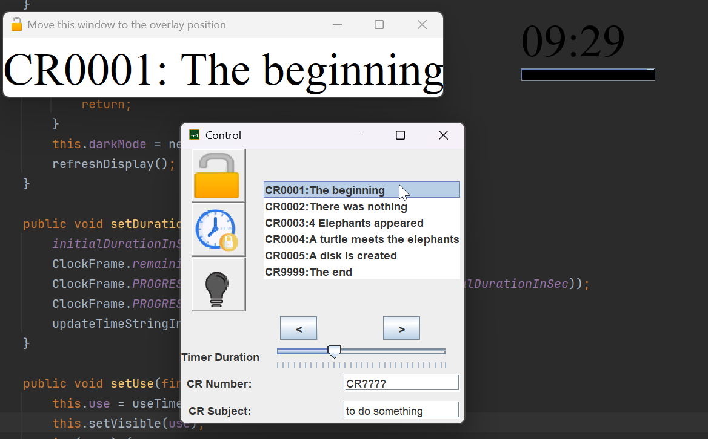

# ⭐ Features
* Overlay on top of all applications
* easy update to next requirement
* public display of time without hindering presentation

# 🖥️️ Screenshots
Overview of panels


# 🧑‍💻️️ Controls/Usage
## Main Control window
## Timer
### Reset Timer
### Adjust Time
## Lock Window in Position

# 🛠️ Conf
Example configuration
```json lines
{
  "initialCountdownDurationInSeconds": 600,
  "features": {
    "useTexts": false,
    "useTimer": true
  },
  "crs": [
    {
      "crNumber": "CR0001",
      "crSubject": "First Requirement"
    },
    {
      "crNumber": "CR0002",
      "crSubject": "Second Requirement"
    }
  ]
}
```
# Licenses
## Font:
https://www.keshikan.net/fonts-e.html